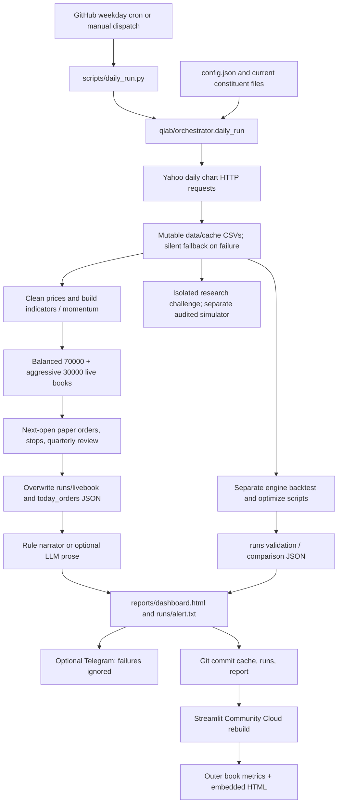

# Phase 0 — current-state audit

Audit date: 2026-09-17. Source baseline: `75dd97e` (deployed data refresh),
with isolated research saved at `94287c7`. No production decisions or history
were modified by this audit. The system is **paper research only**.

## Conclusion

Dhruva has a useful deterministic momentum implementation, real cached market
data, working public hosting and a demonstrated scheduled GitHub run. It does
**not yet** provide trustworthy unattended live evidence. State is mutable,
recovery skips sessions, stale inputs can look healthy, and execution/accounting
claims exceed the implementation. Two recorded live dates are not a track record.

Freeze the exact original experiment before fixes. Preserve its defects as
documented limitations; corrected execution and accounting require a separate
prospective version, not revised historical results.

## What runs today

### Data and signals

`qlab/data.py` fetches Yahoo chart daily OHLCV/adjusted-close via urllib, retries
hosts and caches CSVs. Recent three-month data merge into old five-year history.
`get_universe` skips failed symbols or returns old cache without a quality status.
`clean_ohlc` uses a centered rolling median: later rows can change past inclusion.
Data is not immutable or tied to a run. Current constituent lists imply survivorship
bias. Current liquidity is a useful screen but does not solve membership bias.

`engine.build_panel` computes deterministic factors: 70% 12–1-month and 30%
6–1-month momentum, normalized by volatility. Stocks must pass own trend,
positive momentum and median traded-value tests. Ranking selects up to 15 with
up to four per sector. The Nifty 200-day trend gates new stock exposure.
The LLM only narrates outputs after decisions; it does not select holdings.

### Portfolios, execution and state

`config.books` creates separate ₹70,000 balanced and ₹30,000 aggressive books.
Balanced uses adaptive equity/defensive allocation and trend-gated diversifiers;
aggressive overrides the basket empty and uses a fixed allocation. Both share the
market trend gate and normal 63-trading-session review. They are not independent
buy-weakness and buy-strength strategies.

`livebook.step` attempts yesterday's orders at next available adjusted open,
updates settlement status, evaluates stops/breaker, then schedules review orders.
But sale proceeds are immediately reusable, tax is accrued without a reserve,
stops can fill above the entire day's range, and ATR is raw while prices are
adjusted. Position limits and exit rules differ from the historical engine.
`runs/livebook_*.json` contain current holdings, orders and two daily NAV points.
Files are overwritten and old settled orders pruned. Git commits preserve
occasional snapshots, not immutable, timestamped decision events.

### Backtests and research

`qlab/engine.py` backtests at same-day close with approximate transaction costs,
pre-tax, unlike live execution. `optimize.py` offers walk-forward slices but
fold transitions omit some friction. `scripts/compare3.py` blends daily returns
from two full-capital simulations, effectively free daily rebalancing, rather
than following the independent ₹70k/₹30k live accounts. Historic outputs lack
producing commit/config/input hashes and are not proof of the exact live strategy.

The separate `research/` challenge has a fixed protocol, 10 variants, adjusted
ATR, past-only cleaning, gap stops, settled cash, FIFO/shared modeled tax and
eight passing unit tests. It is explicitly a different audited simulator.
No variant was selected for deployment. Its manifest source hashes still match,
but 505 of 506 cached data files changed during daily refresh. Reconstruct those
inputs from Git before claiming an exact rerun. The supplied cache's earliest
matching Git revision must be verified, not assumed.

### Deployment and actual operation

The public repository is [Andy7204/dhruva](https://github.com/Andy7204/dhruva).
The default deployment uses `main`, `streamlit_app.py` and Streamlit Community
Cloud at [the public app](https://dhruva-andy7204.streamlit.app/).
GitHub Actions installs floating lower-bound dependencies, executes the daily
script and commits `runs/`, `data/cache/` and the HTML. Streamlit serves these
committed files and does not run the strategy itself.

The remote run API returned two completed runs, both successful:

| Trigger | Run | Actual UTC start → completion | Evidence |
|---|---|---|---|
| Manual | 35184975533 | Sep 17 05:14:43 → 05:20:12 | [Run](https://github.com/Andy7204/dhruva/actions/runs/35184975533) |
| Scheduled | 35252434924 | Sep 17 17:23:24 → 17:28:32 | [Run](https://github.com/Andy7204/dhruva/actions/runs/35252434924) |

Cron is `0 13 * * 1-5`: weekdays 18:30 IST. The observed scheduled dispatch was
4h23m after the nominal UTC time. One successful schedule proves it executed
once, not reliable timing or sustained operation. GitHub job success alone does
not prove complete/fresh market data or correct accounting.

Read-only production observation showed September 17 report content, the latest
scheduled refresh, and no current-run timestamp, version, commit or health status.
Outer NAV ₹99,914 differed from embedded ₹99,964 because the earlier run had
already recorded that market date before close, while refreshed quotes changed
the report later. This is preserved as a historical flaw.

## Capability and gap matrix

✅ working within stated scope; 🟡 partial/fragile; ❌ absent; 🗑 misleading/unneeded.
Every row lists implementation, evidence, weakness/value and disposition.

| Capability | Status | Files and actual behavior | Evidence / weakness / value | Action |
|---|---|---|---|---|
| Python engineering | 🟡 | `qlab/*.py`, thin `scripts/` CLIs | Modules run; missing schema checks, atomic transactions and production tests. Useful simple base. | KEEP/FIX |
| Market-data ingestion | 🟡 | `data.py`, cached Yahoo bars | Real caches and successful refresh; failures can return old data as success. Essential. | FIX |
| Data engineering | 🟡 | CSV merge, `clean_ohlc` | Cache scan found no duplicate dates/impossible OHLC; no raw/validated lineage, centered cleaner leaks. | FIX |
| Quantitative finance | 🟡 | `engine`, `livebook`, `costs`, `tax` | Genuine deterministic factors/accounting attempts; tax, units, fill issues reproduced. | KEEP/FIX/version |
| Statistics | 🟡 | `metrics`, `optimize`, `research` | CAGR/risk/walk-forward exist; short live history, initial-cost/fold omissions. | KEEP/FIX |
| Time series | 🟡 | `indicators`, momentum shifts | Lagged momentum works; cleaner changes prefix, raw ATR inconsistency. | FIX/version |
| Backtesting | 🟡 | `engine`, `compare3`, `validate` | Historical simulations run; pre-tax close fills, biases, differing live policy. | FIX; qualify |
| Portfolio construction | 🟡 | `livebook.step`, `engine._momentum_picks` | Integer quantities, capital split, sectors, basket; constraints differ across engines. | KEEP/FIX/version |
| Risk management | 🟡 | Stops, breaker, regime | Implemented; impossible gap fills and cash-bound breaker recovery. | FIX/version |
| APIs | 🟡 | Yahoo/Telegram/narrator HTTP clients | External APIs consumed; no API server. Clients useful; server unnecessary now. | KEEP clients / DEFER server |
| Machine learning | ❌ | No trained model | `learn.py` heuristic weighting is not ML, unused by current live path. | DEFER |
| Adaptive-learning claims | 🗑 | `learn.py`, config/README language | No live feedback training; misleading capability claims. | Remove claims, preserve archive |
| AI/LLM | 🟡 | `narrator.py` | Rule narrator works; optional LLM after quant outputs, no provenance/output checks. No key required. | KEEP optional/FIX |
| Agents | ❌ | No production agents | Coding agents built project; trading agent swarm would add no current value. | DEFER |
| Research orchestration | 🟡 | `optimize`, `news`, `research/` | Useful offline study; current news lacks source URL/retrieval time and outage status. | KEEP/FIX |
| GitHub Actions | ✅ | `.github/workflows/daily.yml` | Manual and scheduled remote success, generated commits. Reliability gaps remain. | KEEP/harden |
| Cron scheduling | 🟡 | Weekday 13:00 UTC | One actual schedule verified, late by >4h; no holidays/missed-run alert. | FIX |
| Streamlit deployment | ✅ | `streamlit_app.py`, public app | Browser rendered dated content; serves committed files. Health is separate concern. | KEEP |
| Persistent storage | 🟡 | Git-tracked JSON/CSV, Docker mounts | Survives committed deployments; uncommitted failures lost, mutable history. | FIX |
| Monitoring | ❌ | None beyond visible console/UI | No heartbeat/watchdog/stale detection. Critical missing value. | BUILD |
| Logging | 🟡 | `print`, local batch log | GitHub console available; no structured stage/run status. | FIX |
| Testing | 🟡 | Eight `research/test_challenge.py` tests | Research tests pass; no production reliability suite or CI at baseline. | BUILD production tests |
| Live performance | 🟡 | `runs/livebook_*.json` | Two dates Sep16–17, recorded balanced ₹69,914.49 + aggressive ₹30k; no live benchmark. | FIX; no track-record claim |
| Reproducibility | 🟡 | Git source/cache, study manifests | Mutable data/dependencies, unversioned strategy and old result provenance. | FIX |
| Product/dashboard UX | 🟡 | `report.py`, `streamlit_app.py` | Usable sections, but conflicting totals and unsupported trust/health wording. | FIX |
| Alerts | 🟡 | `notify.py` Telegram | Adapter exists; delivery failure swallowed, no operational failure notification. | FIX / one channel |

## Dangerous issues and exact reproductions

1. **Past changes when future data is appended.** `data.py:99` centered median:
   `[100,100,200]` drops the last row, appending `[200,200]` retains it.
2. **Missed sessions vanish.** `orchestrator.py:34–38` recomputes inception from
   latest date. Sep14 state + Sep14–17 calendar steps only Sep17, omitting Sep15–16.
3. **Impossible stop fills.** `livebook.py:125–129`: open80/high85/low75/stop90
   sells at90. Raw ATR4 vs correctly adjusted ATR2 at half adjustment factor
   (`indicators.py:87–105`) worsens execution inconsistency.
4. **Tax not reserved.** `livebook.py:39–41,72,203–204`: tax2000 leaves both cash
   and NAV100000. `report.py:344` falsely claims it is set aside. Per-book LTCG
   exemption gives0 versus shared9375 for two100000 gains; instrument taxonomy
   depends on book basket config; holdings use average cost/earliest date, not FIFO.
5. **Unsettled proceeds spent.** `livebook.py:97,111–116`: zero-cash book sells
   100000 then buys990 units same session despite T+1 status. BDay ignores holidays.
6. **Evidence disappears.** `livebook.py:117–119` prunes old settled buys;
   `orchestrator.py:44–47` directly overwrites state/order files. Mid-run failure
   can leave partial books/report; no transaction, event identity or heartbeat.
7. **Outages look like valid conclusions.** `data.py:163–167` returns a 2020 cache
   after mocked API failure. `notify.py:25–26` returns False silently. News failure
   becomes `quiet`. Missing held ticker can raise exact error
   `AttributeError: 'NoneType' object has no attribute 'at'`.
8. **Corrupt/stale UI looks healthy.** `streamlit_app.py:25–32` ignores malformed
   aggressive book; 2020 balanced fixture displays71000 total/70000 start without
   warnings. No freshness contract. Actual production has inconsistent NAV totals.
9. **Portfolio meaning differs from config.** Empty aggressive basket lets
   GOLDBEES rank as a stock (`engine.py:163–171`); max weight/edge checks and exits
   differ between backtest and live. Breaker can remain cash-bound indefinitely.
10. **Historical evidence overstates validity.** `validate.py:25–34` benchmark
    eligibility uses whole-period coverage; current Nifty100 list is still biased.
    `optimize.py:89–101` fold chaining drops initial friction; `metrics.py:26–28,65`
    omits initial entry effect and some costs. README '3-year live' is false.

Probe scripts and JSON results in `docs/evidence/phase0_*` preserve bounded
fixtures. Production source/state remain untouched. Research tests passing does
not contradict these production failures because the engines differ.

## Unnecessary, misleading and missing components

Keep the simple module design and file-based Git deployment. Do not add trained
ML, agent trading, a database server, REST API or commercial features merely for
appearance. Deprecate legacy `show_call`, `news_overlay` and reset paths only
after preserving artifacts and updating consumers: they currently read Sep15
`todays_call` or delete legacy files while ignoring active live books. Archive
unused learning logic and remove claims of active adaptation. `package.py`
excludes `.github` and may include a future `.env`; it is not an authoritative
export mechanism.

Critical missing pieces: frozen strategy identity, immutable decision ledger,
input/config/code provenance, atomic publication, strict data quality/freshness,
structured health, independently evaluated watchdog, reliable external alert,
failure/recovery suite, genuine live benchmark and honest UI labels.

## Recommended execution plan and acceptance

Follow the user's numbered mission without parallel unfinished phases. Phase1
archives exact v1 source/config/universe/state and adds a fail-closed hash guard.
Phase2 introduces append-only evidence, stable identities, restart persistence
and tamper/duplicate tests. Phases3–4 prove workflow and deployed freshness with
actual runtime evidence. Phases5–10 build/verify the guarded canonical pipeline,
quality contract, health, watchdog and one alert channel. Fix economics only in
explicit prospective tracks. Phases11–20 improve honest evaluation, interfaces,
research provenance, UX and methodology; optional technologies remain deferred
unless useful. Phases21–25 document architectural choices, compliance gates and
an evidence-backed case study. Final readiness remains incomplete until tests
and remote demonstrations pass.

Phase0 answers the required data/signals/portfolio/backtest/state/deployment/live
results/silent-failure questions above. Its acceptance is understanding and
evidence, not repaired infrastructure. No later gate is claimed passed.

## Evidence index and reproducible commands

- `docs/evidence/phase0_github_runs.json`: observed remote run metadata.
- `docs/evidence/phase0_streamlit_observation.md`: actual production display.
- `docs/evidence/phase0_engineering_probe.py` / `.json`: temporary reliability fixtures.
- `docs/evidence/phase0_quant_probe.py` / `.json`: in-memory economics/causality fixtures.
- `python -B research/test_challenge.py`: eight separate research tests pass.

Use the bundled Python listed in HARDENING_PROGRESS if system Python is absent.
The Windows console initially raised the AGENTS-known `UnicodeEncodeError`
on ₹; importing `qlab` restored UTF-8 and the probe completed. No production
rerun was used to repair evidence. Audit fixtures are not live trading records.
